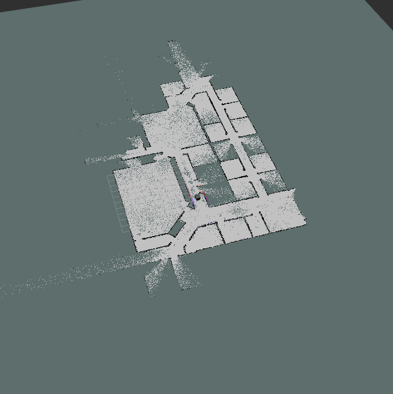

# CMPN462 Cognitive Robotics Term Project

## Run
- first Run Gazebo and Rviz
```bash
    roslaunch summit_xl_sim_bringup summit_xls_complete.launch
```
- Then In the project folder open a terminal and run
```bash
    catkin_make
    roslaunch launcher_pkg run_all.launch
 ```

 ## ScreenShots

### Real Map


### partially Generated Map 


## Contributors

- [@Ahmed Hussien](https://www.github.com/Ahmedh12)
- [@Millania Sameh](https://www.github.com/millaniaSameh)
- [@Nada Abdelrahman](https://www.github.com/nadaabdelgayed)
- [@Nouran Shawky]()

